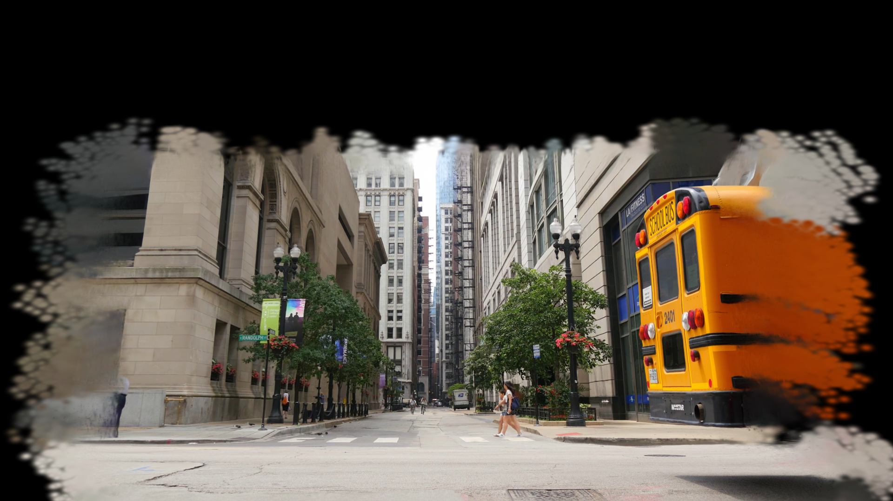
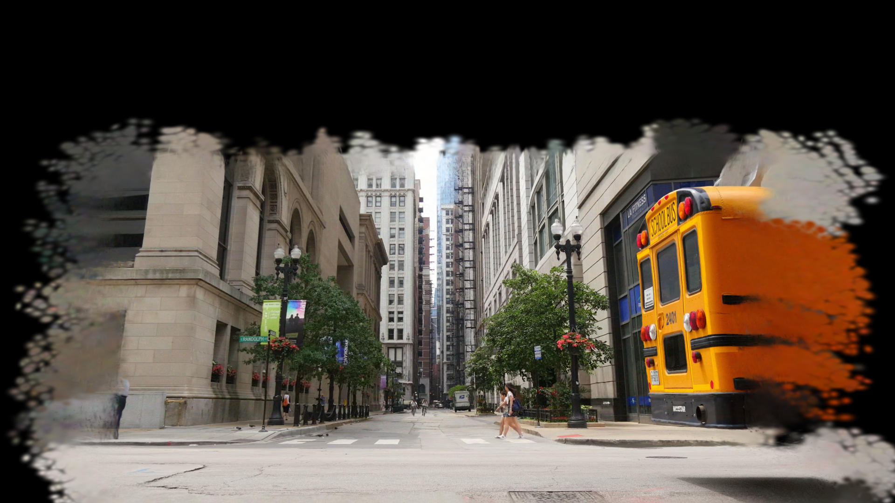
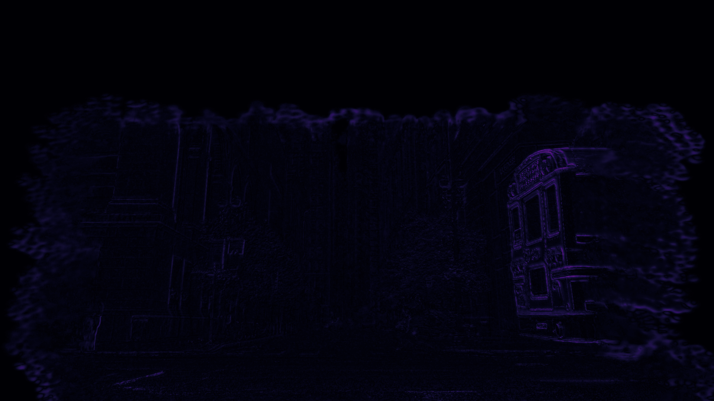
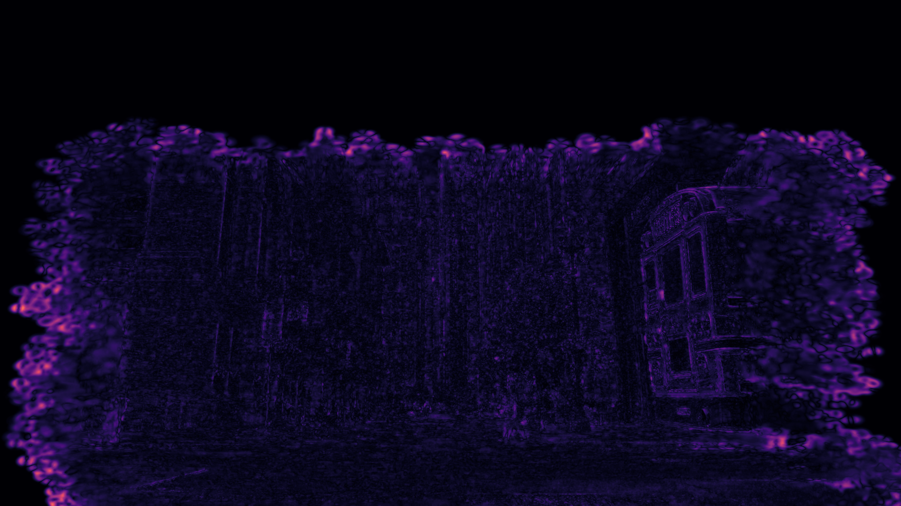

# 4DGS-compression

**Authors:** Aline Baumberger, Alex Foulon <br>
**Affiliation:** École Polytechnique

## Overview

Research prototype that compresses 4D Gaussian Splats by mapping per-frame PLY attributes into structured 2D textures, then applying standard image/video codecs (PNG for spatial, H.264/FFV1 for temporal). Original PLYs can then be reconstructed from the compressed textures and videos.

## Results

| Dataset | Original size | Spatially compressed size | Spatiotemporally compressed size | Final compression rate |
| --- | ---: | ---: | ---: | ---: |
| Bus | 3.69 GB | 751 MB | 262 MB | 14.08x |

## Visual comparison

| Reference | Spatiotemporal compression |
| --- | --- |
|  |  |

| FLIP error (Spatial) | FLIP error (Spatiotemporal) |
| --- | --- |
|  |  |

## Prerequisites
- Windows OS
- Install ffmpeg: https://www.ffmpeg.org/
- Install dependencies:
    ```bash
    pip install plyfile numpy opencv-python
    ```

## CLI Usage

### Spatial compression
Encode a single PLY file into PNG textures:

```bash
python ply_encode_cli.py path/to/input.ply --out-dir path/to/output_dir --png-compression 9
```

Parameters:
- `path/to/input.ply` = input PLY file to encode.
- `--out-dir` = output directory for textures and metadata.
- `--png-compression` = PNG compression level (0-9). Higher = smaller files, slower encode.

Encode all PLY files in a folder (outputs are prefixed with FRAME_i_ in one directory):

```bash
python ply_encode_cli.py --ply-dir path/to/input_dir --out-dir path/to/output_dir --png-compression 9
```

Parameters:
- `--ply-dir` = directory containing input .ply files.
- `--out-dir` = output directory for textures and metadata.
- `--png-compression` = PNG compression level (0-9). Higher = smaller files, slower encode.

Decode PNG textures back into a PLY file:

```bash
python ply_decode_cli.py --metadata path/to/metadata.json --textures-dir path/to/textures_dir --out-dir path/to/output_dir
```

Parameters:
- `--metadata` = metadata JSON produced by the encoder.
- `--textures-dir` = directory containing the encoded PNG textures.
- `--out-dir` = output directory for reconstructed PLY files.

### Spatiotemporal compression
Build H.264 videos from the per-frame textures (one video per texture group). The position texture (`xyz`) is encoded losslessly as FFV1 in a `.mkv` file.


```bash
./encode_textures_to_h264.bat path/to/textures_dir path/to/output_videos 18 30
```

Parameters:
- `path/to/textures_dir` = directory containing per-frame textures and metadata.
- `path/to/output_videos` = output directory for encoded videos.
- `18` = H.264 CRF (quality). Lower means higher quality/larger files.
- `30` = frames per second for the output videos.

Decode H.264 videos back to PLYs:

```bash
python decode_videos_to_ply.py --videos-dir path/to/videos_dir --metadata-dir path/to/metadata_dir --out-dir path/to/output_dir
```

Parameters:
- `--videos-dir` = folder with per-group videos (xyz.mkv, color.mp4, etc).
- `--metadata-dir` = folder with FRAME_i_metadata.json files from encoding.
- `--out-dir` = where reconstructed PLYs are written.

## License

Apache-2.0. See [LICENSE](LICENSE) and [NOTICE](NOTICE).

## Credits

Citation:
```bibtex
@article{baumberger-foulon-4dgs-compression-2026,
    title={Spatio-temporal Compression of 4D Gaussian Splats},
    author={Baumberger, Aline and Foulon, Alex},
    journal={École Polytechnique},
    year={2026}
}
```
